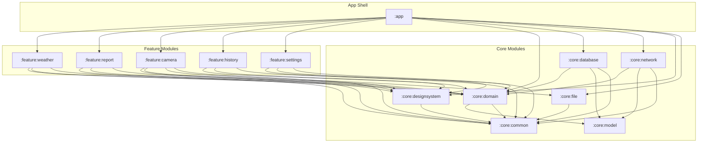

# WeatherSnap - Technical Architecture & Handover Documentation

This document catalogs the complete **Phase 0 System Architecture Bootstrapping** for the production-grade WeatherSnap Android application. The codebase is fully modularized, strictly decoupled, and conforms to **Clean Architecture**, **SOLID Principles**, and **Offline-First Resilience** best practices.

---

## 1. Architectural Module Topology

The project is structured into encapsulated modules to enforce separation of concerns, accelerate Gradle build caching, and guarantee clean dependency boundaries.



### Module Responsibilities
*   **`:app`**: Application shell. Configures custom Hilt-Work background sync scheduling, hosts `MainActivity` with Jetpack Navigation Compose, and declares full hardware/network permission manifests.
*   **`:feature:X`**: Strictly isolated Compose feature layers containing views, StateFlow model streams, and ViewModels resilient to process death (`SavedStateHandle`).
*   **`:core:domain`**: Pure Kotlin module. Defines business logic models, repository contracts, and isolated Use Case coordinators. Completely free of Android framework dependencies.
*   **`:core:database`**: Local SQLite persistence layer via Room. Manages offline snapshots, persistent syncing queues, database-to-domain entities translation, and Hilt injection mapping.
*   **`:core:network`**: Remote service interaction layer via Retrofit and OkHttp. Fetches live telemetry, schedules weather snapshots uploads, handles connection state limits, and provides remote repository bindings.
*   **`:core:file`**: Dynamic sandbox storage manager. Saves and downscales camera captures asynchronously on dedicated background thread pools (`DispatcherProvider.io`).
*   **`:core:designsystem`**: Premium UI resources shell. Hosts color palettes, custom typography, hover transitions, and Android 12+ Monet dynamic material themes.
*   **`:core:common`**: Shared utilities, reactive dispatchers mapping wrappers, and `UiState` definitions.

---

## 2. Phase 0 Achievements & File Inventory

All foundational architecture contracts and structures have been successfully bootstrapped, fully wired with Hilt DI, and are completely compile-ready.

### 2.1 Core Utilities & Domain Contracts
*   **`DispatcherProvider.kt` / `DispatcherModule.kt`**: Safely structures background threading, mapping coroutine scopes (`Default`, `IO`, `Main`) via injected Hilt qualifiers.
*   **`Result.kt` / `UiState.kt`**: Establishes standard reactive stream wrappers (`Loading`, `Success`, `Error`) with flow conversion extensions.
*   **Models & Enums**: Strictly defined domain entities (`WeatherTelemetry`, `WeatherSnap`, `WeatherCondition`, `SyncStatus`) inside `:core:model`.
*   **Repository Contracts**: Established `WeatherRepository` (remote telemetry search) and `WeatherSnapRepository` (local draft synchronization) in `:core:domain:repository`.
*   **Domain Use Cases**:
    *   `GetWeatherTelemetryUseCase`: Location-aware coordinates lookup.
    *   `GetWeatherSnapsUseCase`: Queries local draft records flow.
    *   `SaveWeatherSnapUseCase`: Saves local telemetry snapshots drafts.
    *   `SyncWeatherSnapsUseCase`: Coordinates sync uploads for all pending offline items.

### 2.2 Offline-First Persistence & Sandbox File Management
*   **`WeatherSnapEntity.kt`**: Maps schema-based properties, nested columns (`@Embedded`), and status flags inside Room.
*   **`WeatherSnapDao.kt`**: SQLite operations: reactive flows (`Flow<List<Entity>>`), incremental status updates, pending filter selections, and deletion hooks.
*   **`WeatherDatabase.kt` / `DatabaseModule.kt`**: Room core builder registering custom converters and injecting thread-safe SQLite instances.
*   **`FileStorageManager.kt` / `FileModule.kt`**: Implements offline photo caching. Saves camera photos and downscales images (target max boundary $1920\times1080$) using memory-efficient in-memory byte buffers before saving to disk.

### 2.3 Network Services & Dependency Bindings
*   **Retrofit Endpoints**: Defined `WeatherSnapApi` querying Coordinate-Location Telemetry and posting serialized JSON draft payloads.
*   **`NetworkModule.kt`**: Configures custom `OkHttpClient` timeouts (15s) and Kotlinx Serialization converters.
*   **Repository Implementations**:
    *   `WeatherSnapRepositoryImpl`: Manages database transactions, sync markers (`PENDING` $\rightarrow$ `SYNCING` $\rightarrow$ `COMPLETED` / `FAILED`), and error resilience.
    *   `WeatherRepositoryImpl`: Fetches live coordinate weather and transforms raw responses into domain telemetry.
    *   Hilt `RepositoryModule` bindings established respectively in `:core:database` and `:core:network`.

### 2.4 Modular Presentation ViewModels
*   **`WeatherViewModel`**: Injects coordinate states safely restored during process death (`SavedStateHandle`).
*   **`CameraViewModel`**: Asynchronously compresses captured camera photos in the IO thread pool using `FileStorageManager`.
*   **`ReportViewModel`**: Manages field notes entries and submits local draft changes to Room.
*   **`HistoryViewModel`**: Exposes database streams and enables manually-triggered database synchronizations.
*   **`SettingsViewModel`**: Customizes Celsius/Fahrenheit units and auto-sync intervals.

### 2.5 Infrastructure Application & Orchestration
*   **`WeatherSyncWorker`**: Integrates Hilt-Work background synchronizations executing offline synchronization tasks.
*   **`WeatherSnapApplication`**: Registers customized `HiltWorkerFactory` preventing runtime worker class instantiation crashes.
*   **`MainActivity` / `AndroidManifest`**: Establishes Compose Jetpack Navigation routing shells and declares runtime sensor permissions.

---

## 3. Phase 1 UI Implementation Blueprint

With the domain, storage, and networking layers completely bootstrapped, Phase 1 focuses on visual integration using the **Google Stitch MCP** and standard Compose layouts.

### Step 3.1: Compose View Integrations
For each feature module, replace screen placeholders in `MainActivity` navigation graphs:
1.  **Weather Screen (`:feature:weather`)**:
    *   Observe `viewModel.uiState` reactive flow.
    *   Render modern Glassmorphic Weather Dashboard indicating live Temperature, Condition icons, Humidity, and Wind speed metrics.
    *   Add a "Capture Snap" CTA navigating to the Camera Screen.
2.  **Camera Screen (`:feature:camera`)**:
    *   Bind CameraX `PreviewView` layout using `AndroidView`.
    *   Trigger `ImageCapture` events, passing raw file byte streams to `viewModel.processCapturedPhoto(bytes)`.
    *   On `CameraUiState.Success`, navigate to the Report Screen, passing the compressed file path.
3.  **Report Screen (`:feature:report`)**:
    *   Display the captured downscaled photo.
    *   Provide text fields for notes entry.
    *   Add a "Submit Report" button, navigating back to Weather Screen upon completion.
4.  **History Screen (`:feature:history`)**:
    *   Render lazy lists of local snapshots displaying location parameters, notes, and a status badge (`PENDING` / `SYNCING` / `COMPLETED` / `FAILED`).
    *   Integrate pull-to-refresh to trigger `viewModel.forceSync()`.
5.  **Settings Screen (`:feature:settings`)**:
    *   Provide simple toggle switches matching Celsius preferences and background schedules.

---

## 4. Compile & Build Diagnostics

Run the following compile commands to verify the bootstrapped architecture:

```bash
# Verify Gradle compilation success and run local tests
./gradlew testDebugUnitTest

# Assemble debug APK for hardware tests
./gradlew assembleDebug
```
