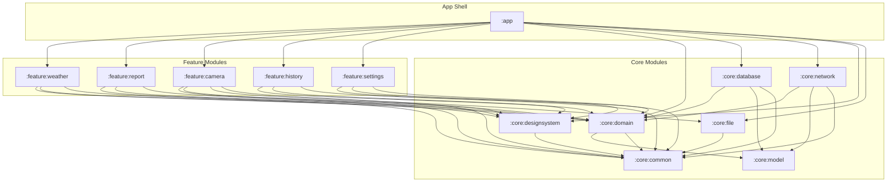

# WeatherSnap 🌤️📸

WeatherSnap is a modern, modular, production-grade Android application engineered with **Clean Architecture**, **SOLID Principles**, and an **Offline-First Resilience** paradigm. It allows location-aware coordinates lookup, image compression, and local telemetries sync with a remote database.

---

## 🏗️ Architectural Module Topology

The project is structured into highly-encapsulated modules to enforce strict separation of concerns, accelerate Gradle build caching, and guarantee clean dependency boundaries.



### Module Responsibilities
*   **`:app`**: Application shell. Configures Hilt-Work background sync worker scheduling, hosts `MainActivity` with Jetpack Navigation Compose, and declares full hardware/network permission manifests.
*   **`:feature:X`**: Strictly isolated Compose feature layers containing views, StateFlow model streams, and ViewModels resilient to process death (`SavedStateHandle`).
*   **`:core:domain`**: Pure Kotlin module containing business logic models, repository contracts, and isolated Use Case coordinators. Completely free of Android framework dependencies.
*   **`:core:database`**: Local SQLite persistence layer via Room. Manages offline snapshots, persistent syncing queues, database-to-domain entities translation, and Hilt injection mapping.
*   **`:core:network`**: Remote service interaction layer via Retrofit and OkHttp. Fetches live telemetry from the Open-Meteo API, handles connection state limits, and provides remote repository bindings.
*   **`:core:file`**: Dynamic sandbox storage manager. Saves and downscales camera captures asynchronously on dedicated background thread pools (`DispatcherProvider.io`).
*   **`:core:designsystem`**: Premium UI resources shell. Hosts color palettes, custom typography, hover transitions, and Android 12+ Monet dynamic material themes.
*   **`:core:common`**: Shared utilities, reactive dispatchers mapping wrappers, and `UiState` definitions.

---

## 🚀 Key Achievements & Technical Features

- **Decoupled Background Threading**: Injected qualifiers via `DispatcherProvider.kt` structure clean coroutine scopes (`Default`, `IO`, `Main`).
- **Reactive Stream Handling**: Stream states (`Loading`, `Success`, `Error`) are managed via custom flow conversion extensions.
- **Offline Persistent Syncing**: SQLite records transit from `PENDING` $\rightarrow$ `SYNCING` $\rightarrow$ `COMPLETED` / `FAILED` status flags with background worker tasks managed by Room and Hilt-Work.
- **Memory-Efficient Image Optimization**: Photos taken by the camera are downscaled asynchronously (target max $1920\times1080$) using memory-efficient byte buffers before disk serialization.
- **No-Key Geocoding & Weather services**: Integrates directly with Open-Meteo APIs for weather and geocoding, requiring zero developer API keys to start.

---

## 🛠️ Developer Setup & Getting Started

### Prerequisites
- JDK 17
- Android SDK (API 34)

### Building the Project

Run verification diagnostics and compilation with Gradle:
```bash
# Verify Gradle compilation success and run local unit tests
./gradlew testDebugUnitTest

# Assemble debug APK for hardware tests
./gradlew assembleDebug
```

---

## 🤖 Google Stitch MCP Integration

The workspace includes integration configs for the **Google Stitch MCP Server** inside `.vscode/mcp.json`.

To configure your own key:
1. Copy `.vscode/mcp.json.template` to `.vscode/mcp.json`.
2. Replace `"YOUR_API_KEY_HERE"` with your active Google Developer API Key.
3. Reload your VS Code developer window.

*(Note: `.vscode/mcp.json` is gitignored to protect your credentials from leaking).*
