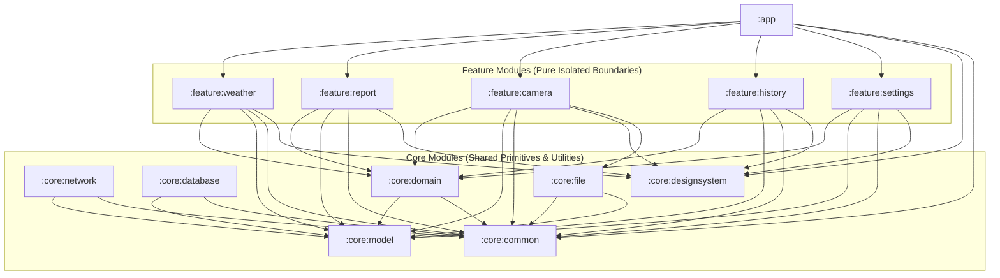

# WeatherSnap: High-Reliability Modular Android Architecture Plan

This document defines the production-grade architectural blueprints, module boundaries, data-flow patterns, and reliability strategies for the **WeatherSnap** Android application. WeatherSnap is built using Kotlin, Jetpack Compose, MVVM + Clean Architecture, Hilt, Room, Retrofit, and CameraX.

---

## 1. Module Architecture & Dependencies

WeatherSnap uses a strictly decoupled, feature-modularized structure to ensure scalability, fast build times, and clear separation of concerns.



### Module Specifications

| Module | Type | Purpose | Key Technologies | Dependencies |
| :--- | :--- | :--- | :--- | :--- |
| **`:app`** | Application | Entry point, Hilt Application class, MainActivity, Navigation Graph, Dependency Injection coordination. | Hilt, Jetpack Navigation | All Feature Modules, `:core:designsystem`, `:core:common` |
| **`:core:common`** | Library (Kotlin/Android) | Common utilities: Result wrapper, `DispatcherProvider` abstraction, lifecycles, Flow helpers, logging. | Kotlin Coroutines, Hilt | None |
| **`:core:model`** | Library (Pure Kotlin) | Pure Kotlin data models shared across modules. Zero Android/UI dependencies. | Kotlin | None |
| **`:core:domain`** | Library (Pure Kotlin) | Business logic interfaces: Repository definitions, Use Cases, validation logic. | Kotlin, Coroutines | `:core:model`, `:core:common` |
| **`:core:network`** | Library (Android) | Remote HTTP networking API interfaces, Retrofit/OkHttp setup, SSL pinning, JSON serialization, API models, network adapters, custom interceptors. | Retrofit, OkHttp, Kotlinx Serialization | `:core:model`, `:core:common` |
| **`:core:database`** | Library (Android) | Persistent storage: Room Database, Entities, DAOs, Migrations, transaction managers. Single source of truth. | Room | `:core:model`, `:core:common` |
| **`:core:file`** | Library (Android) | Secure sandbox file storage for CameraX captured photos, compression pipelines, temporary folder cleanup. | File IO, ImageReader | `:core:common`, `:core:model` |
| **`:core:designsystem`**| Library (Android) | Visual primitives: Colors, Typography, Shapes, Themes, custom UI tokens, reusable basic controls. | Compose UI, Material 3 | `:core:common` |
| **`:feature:weather`** | Library (Android) | Current weather observation screen, geolocation access, local weather fetching. | Compose, Hilt, Play Services Location | `:core:domain`, `:core:model`, `:core:common`, `:core:designsystem` |
| **`:feature:report`** | Library (Android) | Weather snapped reports, combining photo snapshots with real-time telemetry. | Compose, Hilt | `:core:domain`, `:core:model`, `:core:common`, `:core:designsystem` |
| **`:feature:camera`** | Library (Android) | Fullscreen custom Camera overlay, viewfinder, crop/resolution configuration, snap capturing. | CameraX, Compose | `:core:domain`, `:core:model`, `:core:common`, `:core:designsystem`, `:core:file` |
| **`:feature:history`** | Library (Android) | Snap feed history, listing, detail view, retry of failed report uploads, search. | Compose, Hilt | `:core:domain`, `:core:model`, `:core:common`, `:core:designsystem` |
| **`:feature:settings`**| Library (Android) | App configuration, metrics toggling (Celsius/Fahrenheit), offline mode settings. | Compose, Hilt | `:core:domain`, `:core:model`, `:core:common`, `:core:designsystem` |

---

## 2. Clean Architecture Core Layers

Each feature module is structured internally using Clean Architecture principles to enforce the separation of concerns:

```
[UI Layer] (Compose Screens & ViewModels)
     │
     ▼
[Domain Layer] (Use Cases & Repository Interfaces)
     ▲
     │
[Data Layer] (Room DAOs, Retrofit API Services, Repository Implementations)
```

1. **Domain Layer (Presentation-Independent)**:
   - Contains pure business logic.
   - Contains **Repository Interfaces** defining the data operations.
   - Contains **Use Cases** (interactors) representing specific user actions (e.g., `GetWeatherUseCase`, `SaveWeatherSnapDraftUseCase`).
   - Zero framework dependencies (no Retrofit, no Room, no Android imports).
2. **Data Layer (Implementation Details)**:
   - Implements repository interfaces defined in the domain layer.
   - Orchestrates local Room storage vs remote Retrofit storage (Offline-First).
   - Coordinates file compression, metadata attachment, and background synchronization via WorkManager.
3. **Presentation Layer (Jetpack Compose + MVVM)**:
   - Uses **ViewModels** implementing `SavedStateHandle` to survive system-initiated process death.
   - Exposes asynchronous state through Compose-friendly `StateFlow` streams.
   - UI elements are stateless Compose functions that draw visual structures, using theme assets defined in `:core:designsystem`.

---

## 3. High-Reliability Offline-First Sync Architecture

WeatherSnap implements an offline-first architecture to survive spotty networks, extreme cold, or offline situations in deep field conditions.

```
                  ┌────────────────────────┐
                  │      WeatherSnaps      │
                  │   (User Action Trigger)│
                  └───────────┬────────────┘
                              │
                              ▼
                  ┌────────────────────────┐
                  │   Save local draft to  │
                  │   Room (Status: DRAFT) │
                  └───────────┬────────────┘
                              │
                              ▼
                  ┌────────────────────────┐
                  │    Attempt immediate   │
                  │     Network Upload     │
                  └───────────┬────────────┘
                              │
             ┌────────────────┴────────────────┐
             │ SUCCESS                         │ FAILURE
             ▼                                 ▼
┌────────────────────────┐         ┌────────────────────────┐
│ Update Room Status to  │         │ Keep Room Status DRAFT │
│       COMPLETED        │         │ Queue WorkManager Sync │
└────────────────────────┘         └────────────────────────┘
```

### Key Reliability Rules
1. **Room is the Single Source of Truth**: The UI reads only from local database streams (`Flow<List<WeatherSnap>>`). It never presents network payloads directly to the user without writing to the database first.
2. **Persistent Draft System**:
   - When a user starts a weather snap or takes a photo, a draft database entity is instantly created with a `DRAFT` status flag.
   - Drafts are saved in Room before network dispatch. If the process is terminated, the app is backgrounded, or the battery dies, the draft remains and is recovered on next launch.
3. **SavedStateHandle Process Death Recovery**:
   - ViewModels retain their active editing forms, query filters, or camera parameters using `SavedStateHandle`.
   - If Android terminates the app due to memory constraints, the exact user state is restored on rebuild.

---

## 4. Performance & Resource Constraints Strategy

Since WeatherSnap runs under low-resource constraints (e.g., target 8GB Android devices, high CPU/RAM pressure from CameraX), we enforce the following rules:

1. **Dispatcher Abstraction (`DispatcherProvider`)**:
   - Direct injection of `Dispatchers` is prohibited.
   - ViewModels and repositories inject `DispatcherProvider` to enable reliable unit-test double injection.
   - All network serializations, Room operations, and image processing operations run explicitly on `Dispatchers.IO` or specialized background threads.
2. **Recomposition Optimization**:
   - Compose components must use immutable UI models.
   - Avoid long-running calculations in Compose layouts. Wrap heavy operations in `remember` blocks or process them in the ViewModel.
   - Minimize recomposition boundaries by wrapping state reads in scoped layouts or using Compose `derivedStateOf`.
3. **CameraX & Image Compression Pipeline**:
   - CameraX operates in a decoupled background executor.
   - Images captured are written to disk as downscaled, highly compressed JPEGs (JPEG Quality: 80%, Max Dimensions: 1920x1080) to minimize memory foot-print and transmission bandwidth.
   - High-resolution bitmap allocations in RAM are recycled immediately.

---

## 5. Core Primitives & Interfaces

### 5.1 `Result` Wrapper (`:core:common`)
```kotlin
sealed interface Result<out T> {
    data class Success<out T>(val data: T) : Result<T>
    data class Error(val exception: Throwable) : Result<Nothing>
    object Loading : Result<Nothing>
}
```

### 5.2 `UiState` Primitive (`:core:common`)
```kotlin
interface UiState
```

### 5.3 `DispatcherProvider` (`:core:common`)
```kotlin
interface DispatcherProvider {
    val main: CoroutineDispatcher
    val io: CoroutineDispatcher
    val default: CoroutineDispatcher
    val unconfined: CoroutineDispatcher
}
```

---

## 6. Implementation Roadmap

This bootstrap turn establishes **Phase 0** infrastructure:
1. **Module Directories**: Creating app, core, features directories with gradle build files.
2. **Gradle Version Catalog**: Creating `gradle/libs.versions.toml` with Room, Retrofit, CameraX, Compose, Hilt, and Test versions.
3. **Gradle Configurations**: Initializing `build.gradle.kts` (root), `settings.gradle.kts`, and `gradle.properties`.
4. **Scaffolding Core Modules**: Writing foundational files for `:core:common` (Result, DispatcherProvider), `:core:model`, `:core:domain`, `:core:database`, `:core:network`.
5. **Enabling Hilt Dependency Injection**: Setting up the custom App class and base DI Hilt modules (`NetworkModule`, `DatabaseModule`, `RepositoryModule`).
