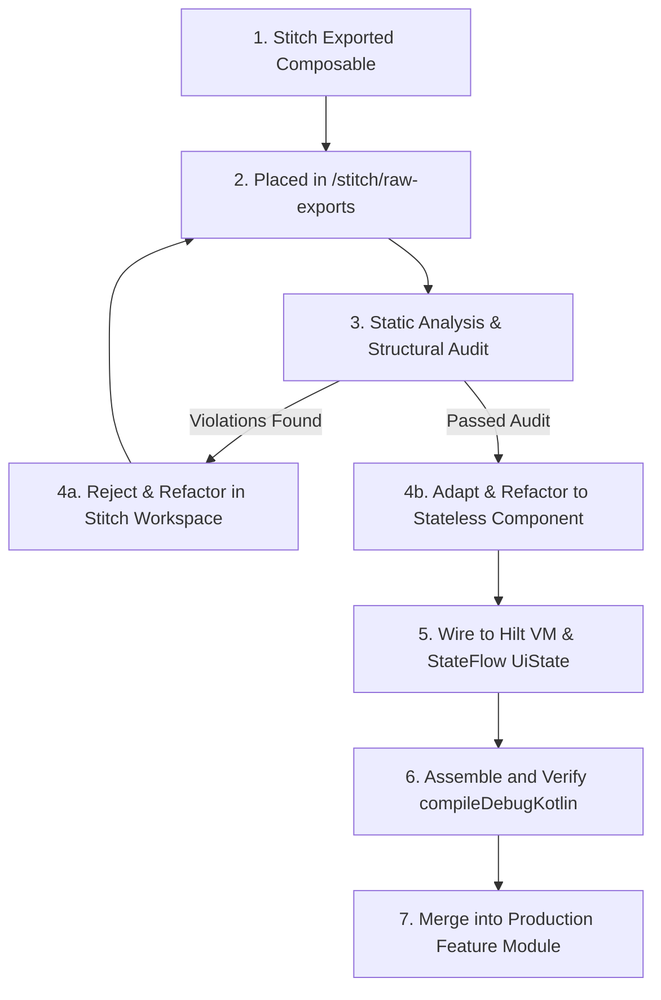

# Stitch Integration Rules & Generated UI Governance Specification

This document establishes the official governance rules, architectural boundaries, integration pipelines, and performance constraints for incorporating Google Stitch MCP-generated UI components into the modular, production-grade WeatherSnap Android application.

---

## 1. Architectural Responsibility Separation (The "Stitch Boundary")

Stitch is an AI-assisted UI design tool optimized for visual generation and structural layouts. To maintain Clean Architecture integrity, we enforce a strict separation of concerns:

```
┌───────────────────────────────────────┐      ┌────────────────────────────────────────┐
│           STITCH LAYER (UI)           │      │       ANDROID APP SYSTEM (LOGIC)       │
├───────────────────────────────────────┤      ├────────────────────────────────────────┤
│ • Layout composition & hierarchy      │      │ • State Management & Flow Generation   │
│ • Component structure & typography    │      │ • Background thread scheduling (IO/Def)│
│ • Styling, Animations, Hover Effects  │ ───> │ • SQLite Room Database Persistence     │
│ • Visual state transitions & shapes   │      │ • Hardware Integrations (CameraX, GPS) │
│ • Static previews and colors          │      │ • API networking & JSON Serialization  │
└───────────────────────────────────────┘      └────────────────────────────────────────┘
```

> [!IMPORTANT]
> **Stitch is responsible *only* for the structural styling and layout layers.** All operations involving background persistence, hardware interactions (such as CameraX byte manipulation), HTTP network pipelines, multi-threaded caching, and enterprise security logic are strictly owned by the native Android compilation system.

---

## 2. Mandatory Directory Architecture (`/stitch`)

To prevent raw, unverified Stitch code from polluting production feature modules, a dedicated workspace is established at the root of the repository. All exported Stitch items must adhere to this structural hierarchy:

```
/stitch
├── raw-exports/
│   ├── weather-home/          # Raw exported screen composites for Weather Home
│   ├── create-report/         # Raw exported screen composites for Create Report
│   ├── weather-camera/        # Raw CameraX UI structure models
│   ├── observation-history/   # Raw list screen representations
│   └── report-details/        # Raw detail screen views
├── assets/
│   ├── typography/            # Exported custom typography specs
│   └── icons/                 # Exported vector icons and static drawables
└── audit-logs/
    └── audit-checklist.md     # Mandatory sign-off log for each integrated screen
```

---

## 3. Strict UI Integration & Verification Pipeline

Every screen and UI component exported by Stitch must pass through a linear gating pipeline before being compiled into the production codebase:



### Pipeline Gates:
1. **Raw Placement**: Raw exports are saved directly to `/stitch/raw-exports/` and are excluded from the main Android project compilation via Gradle exclusions if necessary.
2. **Structural Audit**: A staff-level engineer audits the code against the architecture violations check (Section 4).
3. **Stateless Refactoring**: The component's internal state variables are fully removed, transitioning the component to a stateless representation via State Hoisting.
4. **Wiring & Lifecycle Integration**: The stateless component is wired to Hilt ViewModels, injecting reactive flows and surviving lifecycle configurations through `SavedStateHandle`.
5. **Merge**: The code is moved into the target `:feature` module (e.g., `:feature:weather`) only after passing local unit tests.

---

## 4. Prohibited Architectural Violations Audit (The "Zero-Tolerance" List)

Stitch-generated UI must be audited to detect and excise any pattern that violates our clean boundaries. The following architectural anti-patterns are strictly prohibited:

| Prohibited Pattern | Technical Impact | Mandated Remediation |
| :--- | :--- | :--- |
| **Direct API Networking Inside Composable** | Hardcodes network dependencies, causes main-thread blocking, blocks mock-testing. | Network calls must reside in Retrofit API services inside `:core:network`. |
| **Direct SQLite Room Access in UI** | Violates thread confinement, triggers `IllegalStateException` on main thread. | Query database via use cases inside `:core:domain`, exposing streams through ViewModels. |
| **Mutable Global / Static State** | Triggers unpredictable side-effects, breaks thread safety, causes memory leaks. | Enforce unidirectional state flow (UDF) managed inside the ViewModel's private scope. |
| **Embedded Business / Validation Logic** | Prevents unit testing of business rules, couples presentation directly to rules. | Validation and logic must be isolated in domain `UseCases` inside `:core:domain`. |
| **Navigation Side-Effects in Component** | Breaks single source of truth for navigation, prevents feature isolation. | Trigger route changes using event callbacks passed up to the screen container level. |
| **Non-Hoisted UI States (`mutableStateOf`)** | State is lost on configuration changes (e.g., rotation), breaking user progress. | Hoist UI states to the ViewModel using standard StateFlow wrappers. |
| **Blocking Main Thread Tasks** | Dropped frames, stuttering, and eventual Application Not Responding (ANR) crashes. | Offload all disk/network tasks to the IO dispatcher pool (`DispatcherProvider.io`). |

---

## 5. Unidirectional Architecture Flow & State Hoisting

To maintain strict predictability, all UI components must align with a **Unidirectional Data Flow (UDF)**. Shortcut flows are strictly prohibited:

```
        ┌────────────────────────────────────────────────────────┐
        │                                                        │
        ▼                                                        │
┌──────────────┐   UiState    ┌─────────────┐   Call UseCase   ┌───────────┐
│  Composable  │ <──────────  │  ViewModel  │ ───────────────> │  UseCase  │
└──────────────┘              └─────────────┘                  └───────────┘
       │                             ▲                               │
       │                             │ Flow<Result<T>>               │ Flow<Result<T>>
       │                             │                               ▼
       │ User Event (e.g. onClick)   │                         ┌───────────┐
       └─────────────────────────────┴──────────────────────── │Repository │
                                                               └───────────┘
```

### State Hoisting Constraints:
1. **Stateless UI**: All composable functions under `:feature` modules must be completely stateless.
2. **Single Parameter Contract**: Screen-level composables must accept exactly two foundational arguments:
   * A single, immutable `state: UiState` object containing all required fields.
   * A unified `onEvent: (UiEvent) -> Unit` callback lambda to dispatch actions back up to the ViewModel.
3. **Anti-Injection Rule**: Composables must never direct-inject dependency injection points (`@Inject` or `hiltViewModel()`) inside nested layout nodes. Dependency resolution must only occur at the top-level screen-container node.

---

## 6. Lifecycle-Safe UI & Persistent Drafts

To ensure optimal UX resilience, all user progress must survive configuration changes, application backgrounding, and system-initiated process death.

```
                  ┌──────────────────────┐
                  │ Component Rotation   │
                  │ / App Backgrounding  │
                  └──────────┬───────────┘
                             │
                             ▼
 ┌───────────────────────────────────────────────────────┐
 │   ViewModel survives configuration changes natively   │
 └──────────────────────────┬────────────────────────────┘
                            │
                            ▼
 ┌───────────────────────────────────────────────────────┐
 │   Process Death? Injected SavedStateHandle restores    │
 │       primary IDs, selections, and search terms       │
 └──────────────────────────┬────────────────────────────┘
                            │
                            ▼
 ┌───────────────────────────────────────────────────────┐
 │    Complex draft states (e.g. captured photos and     │
 │   field notes) are loaded reactively from Room        │
 └───────────────────────────────────────────────────────┘
```

### Implementation Guidelines:
* **Primitive State Preservation**: Simple variables (e.g., current location coordinates, search queries) must be bound to `SavedStateHandle` using delegate accessors to survive system-initiated process reclamation.
* **Complex Data Caching**: Partial notes, compressed photo paths, and local snapshot drafts must be saved incrementally to the SQLite database via `:core:database` using `WeatherSnapRepository.saveWeatherSnap(snap)`.
* **Resource Restoration**: Upon system restoration, the ViewModel must read the persistent database draft reactively, resuming the user's state exactly where they left off.

---

## 7. Compose Performance Governance (Optimized for 8GB RAM)

To guarantee consistent 60fps renders on target hardware, all Stitch-integrated UI must follow strict performance guidelines:

* **Strict Immutability**: All model classes used inside UI states must be annotated with `@Immutable` or `@Stable`. Standard collections (e.g., `List`) must be mapped to kotlinx immutable counterparts (`PersistentList`) to prevent redundant recompositions.
* **Avoid Unnecessary Recompositions**: Nested composables must accept primitive inputs or stable references. Heavy transformations must be calculated outside the composable layer or wrapped inside `remember(key)`.
* **Smart Memory Allocations**: Large lists (such as the Observation History) must use `LazyColumn` or `LazyRow` combined with explicit `items(key = { ... })` keys to ensure efficient viewport recycling.
* **Thread-Confinement (Main Thread Isolation)**: The main thread must never run expensive database calculations or picture compression algorithms. All image downscaling operations must be scheduled via `DispatcherProvider.io` within the `:core:file` sandbox.

---

## 8. Navigation Integration & Feature Isolation

Navigation across Stitch-integrated pages is decoupled using Jetpack Navigation Compose with sealed destination routes to maintain compilation isolation:

```kotlin
sealed class Screen(val route: String) {
    data object WeatherHome : Screen("weather")
    data object CreateReport : Screen("report")
    data object WeatherCamera : Screen("camera")
    data object ObservationHistory : Screen("history")
    data class ReportDetails(val snapId: String) : Screen("details/{snapId}") {
        companion object {
            fun createRoute(snapId: String) = "details/$snapId"
        }
    }
}
```

### Rules:
1. **Isolated Routing**: Feature modules must not contain direct references to another feature module's components. All inter-screen movements must proceed via callback triggers hoisted to the `:app` shell navigation host.
2. **Primitive Argument Limits**: Navigation arguments must be restricted to basic primitives (e.g., `String` ID). Passing complex data payloads across navigation routes is strictly prohibited; the receiving screen must load detailed records reactively from the database using the passed identifier.

---

## 9. Screen-by-Screen Specification Rules

Every Stitch screen integrated into WeatherSnap must fulfill specific functional boundaries:

### 9.1 Weather Home Screen (`:feature:weather`)
* **Visual Structure**: Glassmorphic current weather card (temperature, location, weather condition vector, wind speed, humidity) and an predictive weather recommendation text layout.
* **System Responsibility**: ViewModel queries location telemetry reactively, maps raw location parameters to the user coordinates, and provides real-time search queries.

### 9.2 Create Report Screen (`:feature:report`)
* **Visual Structure**: Picture preview container, location info chip, form notes text field, and custom validation error indicators.
* **System Responsibility**: Draft states must survive process death. Notes entries are saved incrementally to Room. Submitting the report updates the draft status in the local DB.

### 9.3 Weather Camera Screen (`:feature:camera`)
* **Visual Structure**: CameraX viewport overlay, flash status button, shutter trigger, and dynamic resolution downscaling progress bar.
* **System Responsibility**: Integrates the CameraX lifecycle to provide smooth frame renders. Captured photos are asynchronously saved, compressed, and resized (max boundary $1920\times1080$) inside `:core:file` on a background thread pool, shielding the main thread from allocation overhead.

### 9.4 Observation History Screen (`:feature:history`)
* **Visual Structure**: Grouped lazy-list entries showing captured photos, date labels, and colored status chips indicating synchronization states (`PENDING`, `SYNCING`, `COMPLETED`, `FAILED`).
* **System Responsibility**: Emits data reactively from the Room database. Pull-to-refresh action dispatches to the `SyncWeatherSnapsUseCase` to initiate network synchronizations.

### 9.5 Report Details Screen (`:feature:report`)
* **Visual Structure**: Immutable, full-screen viewport displaying high-fidelity weather telemetry parameters, static location maps, and persistent observations.
* **System Responsibility**: Loads the specific historical record as an immutable domain entity using `SavedStateHandle` arguments. No inline data changes are permitted.
